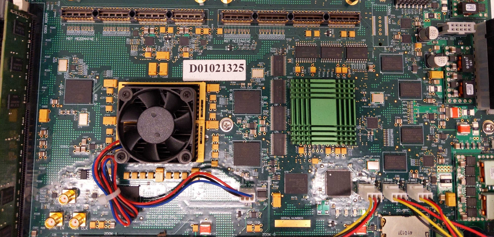

# Holography Hardware #

This README will outline, and make reference to, the following:
1. [ROACH2 FPGA](#roach2-fpga)
2. [Supporting Equipment](#supporting-equipment)

The schematic below serves as an example setup for performing holography. This is also the setup used at the University of Chicago in 2021. 

## ROACH2 FPGA ##

Processing the measured signals requires an FPGA. Holography at UChicago uses the Casper ROACHH2 board. ROACH stands for Reconfigurable Open Architecture Computing Hardware.  The full hardware specifications can be found at the [Casper ROACH2 public repository](https://github.com/casper-astro/casper-hardware/tree/master/FPGA_Hosts/ROACH2). 

The FPGA is powered via a standard power supply cable. The ROACH2 is programmed via Ethernet connection.  For installation instructions, see the [Casper ROACH2 repository](https://github.com/casper-astro/casper-hardware/tree/master/FPGA_Hosts/ROACH2). Once installed, see [holog-exp/software](https://github.com/McMahonCosmologyGroup/holog-exp/tree/main/software) for tutorials and software for data acquisition.

## Supporting Equipment ##

All [datasheets](https://github.com/McMahonCosmologyGroup/holog-exp/tree/main/hardware/Supporting_Equipment/Datasheets) are provided.

- [Cables](Supporting_Equipment/Equipment_cables.md)
- [Signal Management](Supporting_Equipment/Signal_management.md)
- [Correlation Electronics](Supporting_Equipment/Correlation_electronics.md)
